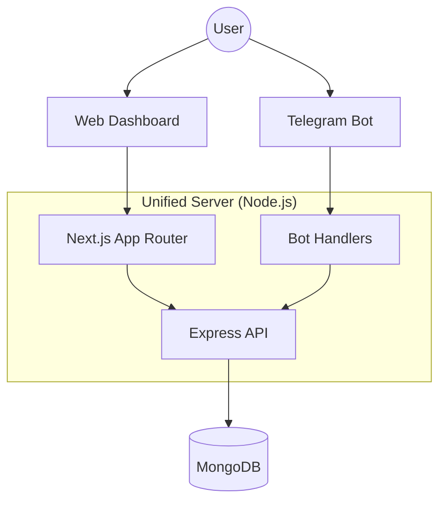

# 👨‍🍳 MasterChef Logistics Dashboard
[](https://github.com/BrijeshJagad/MasterChefInd-bot)
[](https://opensource.org/licenses/MIT)

A **production-grade canteen management ecosystem** featuring a high-fidelity web dashboard and an integrated Telegram bot. Built for scale, security, and a premium user experience.

---

## 🚀 Key Features

### 💎 Ultimate Dashboard V8.0
*   **Modern Aesthetics**: Glassmorphism 3.0 icons, smooth transitions, and a curated deep-slate dark mode.
*   **Fully Responsive**: PWA-ready layout that adapts perfectly from mobile devices to desktop monitors.
*   **Interactive History**: Navigate through all historical menu data with a persistent sidebar.
*   **One-Click Export**: Download any weekly menu as a professional PDF or raw JSON data.

### 🤖 Intelligent Telegram Bot
*   **Document Parsing**: Automatically extracts menu data from floating-coordinate PDFs.
*   **Broadcast Ready**: Direct integration with the MasterChef community for instant updates.
*   **Admin Controls**: Securely upload and manage menus directly via Telegram or the web portal.

### 🛡️ Hardened Backend
*   **Unified Server**: Orchestrates Next.js, Express, and Telegram Polling in a single high-performance process.
*   **Security First**: Integrated with `helmet` for headers, `express-rate-limit` for API protection, and password-validated admin routes.
*   **Weekly Indexing**: Robust `YYYYWW` indexing system for bulletproof data retrieval.

---

## 🛠️ Tech Stack

*   **Frontend**: React (Next.js 15+), Material UI 6+, Glassmorphism UI
*   **Backend**: Node.js, Express, Next.js Unified Routing
*   **Bot**: `node-telegram-bot-api`
*   **Database**: MongoDB (Mongoose)
*   **Security**: Rate-Limiting, Helmet, Password Encryption

---

## 📥 Getting Started

### 1. Installation
```bash
git clone https://github.com/BrijeshJagad/MasterChefInd-bot.git
cd MasterChefInd-bot
npm install
```

### 2. Configuration
Create a `.env` file in the root directory:
```env
BOT_TOKEN=your_telegram_bot_token
MONGO_URI=your_mongodb_connection_string
ADMIN_PASSWORD=your_secure_upload_password
PORT=3000
```

### 3. Launch
```bash
npm run dev
```

---

## 🏗️ Architecture



---

## 👤 Maintainer

**Brijesh Jagad**  
[](https://in.linkedin.com/in/brijesh-jagad)
[](https://github.com/BrijeshJagad)

---
Built with the **BMAD Method** for high-velocity, high-quality development.
